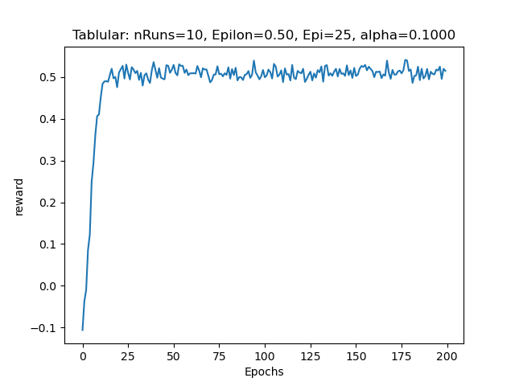
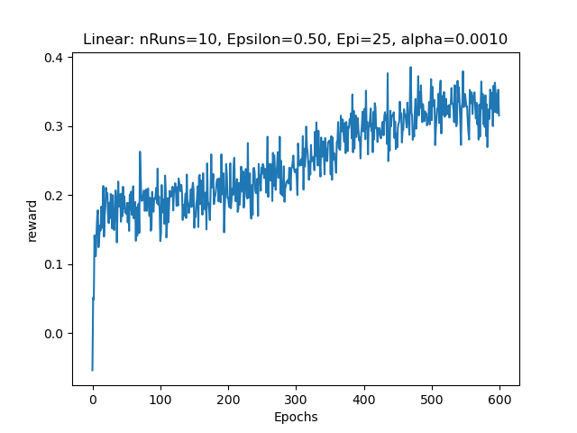
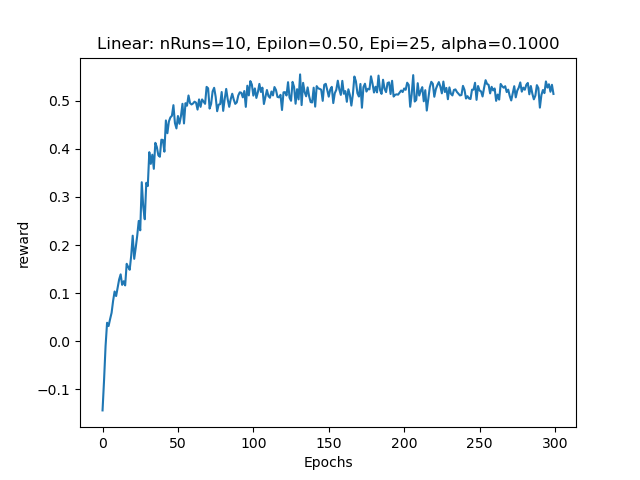

# Reinforcement Learning for Text-Based Home World

A reinforcement learning project that explores and compares **Tabular Q-Learning**, **Linear Function Approximation**, and **Deep Q-Networks (DQN)** in a text-based interactive environment.

The project demonstrates how reinforcement learning methods can evolve from explicit state-action value tables to learned function approximators as the state space becomes more complex.

## Overview

The agent interacts with a text-based **Home World** environment. At each step, the environment provides textual descriptions of the agent's current room and quest.

The agent must learn to select an appropriate combination of:

- **Action** — e.g. `eat`, `sleep`, `watch`, `exercise`, or `go`
- **Object** — e.g. `apple`, `bed`, `tv`, `bike`, or a navigation direction

The objective is to complete the assigned quest while maximizing cumulative discounted reward.

Examples of quests include:

- "You are bored."
- "You are getting fat."
- "You are hungry."
- "You are sleepy."

The environment contains four locations:

- Living Room
- Garden
- Kitchen
- Bedroom

Each location can have multiple textual descriptions, requiring the agent to reason from observed text rather than directly accessing the underlying environment state.

---

## Methods

### 1. Tabular Q-Learning

The first implementation represents each unique textual state using a discrete index.

A state consists of:

$$
\text{state} = (\text{room description},\ \text{quest description})
$$

where:

- `room_description` represents the textual description of the agent's current room;
- `quest_description` represents the agent's current quest.

The agent maintains a Q-table containing a Q-value for each state-command pair.

Each command consists of an action and an object:

$$
c = (\text{action},\ \text{object})
$$

For example:

- `eat apple`
- `sleep bed`
- `watch tv`
- `exercise bike`
- `go north`

For each transition $$(s, c, r, s')$$, the Q-value is updated using the Q-learning rule:

$$
Q(s,c) = Q(s,c) + \alpha \left[r + \gamma \max_{c'} Q(s',c') - Q(s,c)\right]
$$

where:

- $$\alpha$$ is the learning rate;
- $$\gamma$$ is the discount factor;
- $$r$$ is the immediate reward;
- $$\max Q(s', c')$$ represents the highest Q-value among all possible commands in the next state.

For terminal states, there is no future Q-value, so the update becomes:

$$
Q(s,c) = Q(s,c) + \alpha \left[r - Q(s,c)\right]
$$

An **epsilon-greedy policy** is used to balance exploration and exploitation:

- with probability $$\epsilon$$, the agent selects a random command;
- with probability $$1 - \epsilon$$, the agent selects the command with the highest current Q-value.

Experiments were performed with different values of $$\epsilon$$ and $$\alpha$$ to investigate how exploration and learning rate affect convergence and agent performance.

---

### 2. Linear Function Approximation

Maintaining an explicit Q-value for every state-action pair becomes impractical as the state space grows.

To address this limitation, the second implementation approximates the Q-function using a linear model:

$$
Q(s,c;\theta) = \phi(s,c)^T \theta
$$

where:

- $$\phi(s,c)$$ is the feature vector representing the state-command pair;
- $$\theta$$ is the learnable parameter vector.

Textual states are first converted into vector representations using a **Bag-of-Words (BoW)** representation:

`Text State → Bag-of-Words → State Feature Vector`

To distinguish different commands, the state feature vector is placed into a command-specific feature block:

$$
\phi(s,c) = [0,\ldots,\psi_R(s),\ldots,0]
$$

This allows each command to learn its own parameter vector while using the same state representation framework.

For each transition $$(s, c, r, s')$$, the temporal-difference (TD) error is:

$$
\delta = r + \gamma \max_{c'} Q(s',c') - Q(s,c)
$$

where the maximum is taken over all possible next commands $$c'$$.

For terminal states, there is no future Q-value, so:

$$
\delta = r - Q(s,c)
$$

The parameters are updated using:

$$
\theta = \theta + \alpha \delta \phi(s,c)
$$

where $$\alpha$$ is the learning rate.

This experiment also demonstrates an important limitation of linear function approximation: a simple linear model may not have sufficient representational capacity to accurately approximate the Q-function, even in a relatively small environment.

---

### 3. Deep Q-Network (DQN)

The final implementation replaces the linear Q-function approximator with a **Deep Q-Network (DQN)**.

The textual state is first transformed into a Bag-of-Words feature vector:

`Text State → Bag-of-Words → DQN → Q-values`

The neural network predicts Q-values for possible actions and objects.

For each transition:

$$(s, a, r, s')$$

the Q-learning target for a non-terminal state is:

$$
y = r + \gamma \max_{a'} Q(s',a')
$$

where the maximum is taken over all possible next actions $$a'$$.

For a terminal state, there is no future reward, so the target becomes:

$$
y = r
$$

The prediction error is measured using the squared loss:

$$
L = \frac{1}{2}\left(y - Q(s,a)\right)^2
$$

The DQN parameters are then updated using gradient-based optimization to minimize this loss.

An **epsilon-greedy policy** is used for action selection:

- with probability $$\epsilon$$, the agent selects a random action;
- with probability $$1 - \epsilon$$, the agent selects the action with the highest predicted Q-value.

During training, the DQN parameters are updated from observed transitions. During testing, the learned policy is evaluated without updating the network.

---

## Environment

The Home World contains four rooms with multiple natural-language descriptions.

| Room | Example Relevant Interaction |
|------|------------------------------|
| Living Room | Watch TV |
| Garden | Exercise / ride bike |
| Kitchen | Eat an apple |
| Bedroom | Sleep in bed |

The environment provides positive reward for successfully completing a quest and negative rewards for unnecessary or invalid actions.

Each episode terminates when either:

1. the agent successfully completes the quest, or
2. the maximum number of environment steps is reached.

---

## Evaluation

The project evaluates and compares three Q-learning approaches:

1. **Tabular Q-Learning**
2. **Q-Learning with Linear Function Approximation**
3. **Deep Q-Learning (DQN)**

All three approaches are evaluated using **cumulative discounted episodic reward**:

$$
G = r_0 + \gamma r_1 + \gamma^2 r_2 + \cdots + \gamma^{T-1} r_{T-1}
$$

Training and testing are performed separately.

During training, each agent updates its Q-function according to its representation:

- **Tabular Q-Learning:** directly updates entries in a Q-table.
- **Linear Q-Learning:** updates the parameter matrix $$\theta$$ using gradient-based updates.
- **Deep Q-Learning:** updates the weights of a neural network using the temporal-difference target and gradient descent.

During testing, the learned policy is evaluated without updating the Q-function or model parameters.

Performance is averaged across multiple testing episodes and experimental runs to reduce the effect of randomness and provide a more reliable estimate of agent performance.

The experiments demonstrate how the choice of Q-function representation affects learning behavior and performance, progressing from discrete tabular representations to linear function approximation and finally to neural-network-based approximation.

---

## Output

The following learning curves visualize the training and testing performance of the reinforcement learning agents using average episodic reward.

### Tabular Q-Learning

The Tabular Q-Learning agent learns rapidly during the early stages of training. The average episodic reward increases from approximately `-0.1` to around `0.5` and becomes relatively stable after approximately `15–20 epochs`.

Across multiple experimental runs, the converged average reward remains close to `0.5`, indicating that the learned policy is relatively stable and consistent. Small fluctuations remain after convergence due to the stochastic nature of epsilon-greedy action selection and evaluation.

Overall, the results demonstrate that Tabular Q-Learning can efficiently learn a stable policy for this relatively small discrete environment.

#### Example Output

```
RUN ---> python agent_tabular_ql.py

            Avg reward: 0.497583 | Ewma reward: 0.507615: 100%|█| 200/200 [00:01<00:00, 141.
            Avg reward: 0.499303 | Ewma reward: 0.492417: 100%|█| 200/200 [00:01<00:00, 152.
            Avg reward: 0.492159 | Ewma reward: 0.519425: 100%|█| 200/200 [00:01<00:00, 159.
            Avg reward: 0.473569 | Ewma reward: 0.481953: 100%|█| 200/200 [00:01<00:00, 166.
            Avg reward: 0.489471 | Ewma reward: 0.498283: 100%|█| 200/200 [00:01<00:00, 167.
            Avg reward: 0.503508 | Ewma reward: 0.532613: 100%|█| 200/200 [00:01<00:00, 126.
            Avg reward: 0.501479 | Ewma reward: 0.535060: 100%|█| 200/200 [00:01<00:00, 118.
            Avg reward: 0.485003 | Ewma reward: 0.508956: 100%|█| 200/200 [00:01<00:00, 107.
            Avg reward: 0.491784 | Ewma reward: 0.526178: 100%|█| 200/200 [00:01<00:00, 138.
            Avg reward: 0.495387 | Ewma reward: 0.515503: 100%|█| 200/200 [00:01<00:00, 126.
```



### Linear Function Approximation

The Linear Q-Learning agent achieves an average episodic reward of approximately `0.25` across multiple experimental runs.

Despite training for `600 epochs`, its performance remains substantially below the Tabular Q-Learning agent, which achieves an average reward of approximately `0.5`. This suggests that the linear function approximator is unable to represent the Q-function sufficiently well for this environment.

The result demonstrates an important limitation of simple linear function approximation: although it reduces the need to maintain a separate Q-value for every state-command pair, the restricted representational capacity can lead to significantly lower policy performance.

#### Example Output

```
RUN ---> python agent_linear.py

            Avg reward: 0.258785 | Ewma reward: 0.354678: 100%|█| 600/600 [00:34<00:00, 17.6
            Avg reward: 0.255159 | Ewma reward: 0.359309: 100%|█| 600/600 [00:34<00:00, 17.1
            Avg reward: 0.262132 | Ewma reward: 0.330960: 100%|█| 600/600 [00:34<00:00, 17.5
            Avg reward: 0.256357 | Ewma reward: 0.316044: 100%|█| 600/600 [00:33<00:00, 17.9
            Avg reward: 0.259168 | Ewma reward: 0.385576: 100%|█| 600/600 [00:32<00:00, 18.4
            Avg reward: 0.254242 | Ewma reward: 0.360913: 100%|█| 600/600 [00:34<00:00, 17.5
            Avg reward: 0.224929 | Ewma reward: 0.323760: 100%|█| 600/600 [00:36<00:00, 16.4
            Avg reward: 0.258680 | Ewma reward: 0.299341: 100%|█| 600/600 [00:32<00:00, 18.2
            Avg reward: 0.245529 | Ewma reward: 0.320811: 100%|█| 600/600 [00:34<00:00, 17.5
            Avg reward: 0.224714 | Ewma reward: 0.261852: 100%|█| 600/600 [00:36<00:00, 16.3

```



### Deep Q-Learning (DQN)

The DQN achieves an average episodic reward of approximately **0.47** across 10 experimental runs.

The learning curve shows a rapid improvement during the early stages of training, followed by relatively stable performance after approximately 60–100 epochs. The reward stabilizes around `0.50–0.53` in the learning curve.

Compared with the linear function approximator, the DQN achieves substantially better performance, demonstrating that the nonlinear neural-network representation is better able to approximate the Q-function for this environment.

#### Example Output

```
RUN ---> python agent_dqn.py

            Avg reward: 0.468756 | Ewma reward: 0.519246: 100%|█| 300/300 [00:56<00:00,  5.3
            Avg reward: 0.469638 | Ewma reward: 0.530501: 100%|█| 300/300 [00:49<00:00,  6.0
            Avg reward: 0.476111 | Ewma reward: 0.532606: 100%|█| 300/300 [00:48<00:00,  6.2
            Avg reward: 0.473854 | Ewma reward: 0.530444: 100%|█| 300/300 [00:48<00:00,  6.2
            Avg reward: 0.480406 | Ewma reward: 0.526519: 100%|█| 300/300 [00:46<00:00,  6.4
            Avg reward: 0.482150 | Ewma reward: 0.497850: 100%|█| 300/300 [00:49<00:00,  6.0
            Avg reward: 0.468225 | Ewma reward: 0.514457: 100%|█| 300/300 [00:50<00:00,  5.9
            Avg reward: 0.476535 | Ewma reward: 0.502785: 100%|█| 300/300 [00:46<00:00,  6.5
            Avg reward: 0.475726 | Ewma reward: 0.508126: 100%|█| 300/300 [00:48<00:00,  6.2
            Avg reward: 0.470882 | Ewma reward: 0.538041: 100%|█| 300/300 [01:04<00:00,  4.6

```



---

## Experimental Progression

The project illustrates the progression from exact value storage to learned representations:

| Method | State Representation | Q Representation | Main Limitation |
|--------|----------------------|------------------|-----------------|
| Tabular Q-Learning | Discrete state index | Q-table | Does not scale to large state spaces |
| Linear Q-Learning | Bag-of-Words | Linear function | Limited representational capacity |
| DQN | Bag-of-Words | Neural network | More computationally expensive |

This progression demonstrates why function approximation becomes important when reinforcement learning agents operate in increasingly large or complex observation spaces.

---

## Key Concepts Implemented

- Q-Learning
- Bellman updates
- Temporal-difference learning
- Epsilon-greedy exploration
- Exploration vs. exploitation
- Cumulative discounted rewards
- Bag-of-Words state representations
- Feature engineering
- Linear function approximation
- Gradient-based Q-learning
- Deep Q-Networks
- PyTorch model training
- Reinforcement learning evaluation

---

## Tech Stack

- Python
- NumPy
- PyTorch
- Matplotlib

---

## Key Takeaways

This project highlights the trade-off between model simplicity and representational power in reinforcement learning.

**Tabular Q-Learning** performs well when the complete state-action space is small enough to enumerate, but its memory requirements grow rapidly with the number of states.

**Linear function approximation** provides a scalable alternative by sharing parameters across states, but its performance depends heavily on the quality and expressiveness of the chosen features.

**Deep Q-Learning** provides greater representational capacity by learning nonlinear relationships between textual state features and expected future rewards.

Overall, the project demonstrates a natural progression:

**Q-Table → Feature Engineering → Linear Approximation → Neural Q-Function**

and provides practical experience with both classical and deep reinforcement learning techniques.